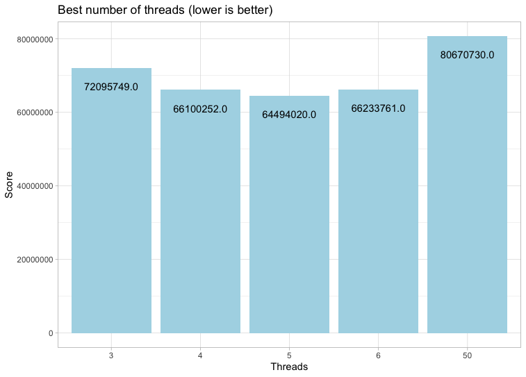

### Group 6, Included Eagles
___________________________________________________________________________
# Final Submission
The following features are what is implemented in our final submission to the OS Challenge.

- Item 1
- Item 2

# Experiments
## Thread Prioritization
###### Author: Lasse Pedersen, s174253

#### Experiment Motivation
I found out about the possibility to prioritize each individual thread in Linux using the Pthread-library by changing the threads attributes. This however requires you to explicitly set the scheduler policy, which can also be done through the Pthread library. The reason for the experiment was that I was interested in knowing if the inbuilt scheduler could be manipulated into prioritizing those specific threads who are specifically assigned to running the reverse hashing algorithm. The mindset was that if these threads could be given priority over system tasks, an improvement in performance would hopefully be noticeable. But before being able to set the thread-priority you first have to assign the scheduler policy. The default Linux policy is 'SCHED\_OTHER', which is a time-sharing round-robin scheduler who will assign each task a certain amount of time pending on what other tasks that are running in the system. There are a number of alternative policies, but I will mainly be focusing on SCHED\_FIFO and SCHED\_RR, who both are real-time policies that will pre-empt (interrupt) every other task. These will allow me to set their individual thread priority (SCHED\_OTHER does not allow for setting priorities). For proof of concept the thread priority will be loosely based on the task priority. 

#### Setup
The tests stated below have all run on the same machine. Three before implementing thread prioritization, three after with the Round-Robin scheduler and another three after with the FIFO scheduler. The tests copies most of the settings from the `run-client-milestone.sh`-script, but the *PRIO\_LAMBDA* have been changed. *PRIO\_LAMBDA* have changed to create an increase in more different package priorities. Which is needed in order for the thread prioritization to be effective. Please see the implementation in the `thread-priority`-branch.

##### Run Configuration
| Setting           | Value         |
| ------------------|:-------------:|
| SERVER            | 192.168.101.10|
| PORT              | 5003          |
| SEED              | 3435245       |
| TOTAL             | 100           |
| START             | 0             |
| DIFFICULTY        | 30000000      |
| REP\_PROB\_PERCENT| 20            |
| DELAY_US          | 75000         |
| PRIO_LAMBDA       | 0.30          |

The results of the nine runs can be found in the Results-section.

##### Hardware Specification
All tests have run on the same computer (using Vagrant). The specifications of the computer is listed below:

| Specification     | Value         |
| ------------------|:-------------:|
| CPU               | Intel i7      |
| CPU clock speed   | 2.5 GHz       |
| No. of CPU cores  | 4             |
| RAM amount        | 16 GB         |
| RAM type          | 1600 MHz DDR3 |
| OS                | macOS 10.14.6 |

##### Possible Errors
Although all tests have been conducted on the same machine, with WIFI and Bluetooth disabled. There is still the possibility for errors coming from background OS tasks. These I have tried to keep at a minimum by disabling as much as possible, such as anti-virus programs etc. The tests have been conducted on a laptop with the battery being at 100% and plugged in to power and on a cooling pad in order to try and manage thermal conditions. The tests were run back-to-back.

#### Results
Below are the results of the nine runs. Thousand separators are added for easier reading.

| Run          | Before           |With Round-Robin  |With FIFO        |
| -------------|:----------------:|:----------------:|:---------------:|
| First run    | 85.753.653 	   | 86.106.845       | 86.699.428      |
| Second run   | 85.787.545	       | 85.518.831       | 86.446.192      |
| Third run    | 87.488.100   	   | 85.497.092       | 86.571.903      |
| **Median**   |**85.787.545**    |**85.518.831**    |**86.571.903**   |

The results also indicated that nearly all prioritization levels were used in the tests. Ranging between level 1 and level 16.

#### Conclusion
The results indicated that there is no real performance benefit from manipulating the OS scheduler. The numbers fluctuate between being either slightly faster or slightly slower with the scheduler policy and thread prioritization set. So, in conclusion, I think the OS scheduler is perfectly alright at self-managing individual tasks and in an environment were all background tasks were kept at a minimum then the OS scheduler had really no other tasks to down prioritize (with or without the experiment implementation).

## Optimizing 'memcmp'
###### Author: Lasse Pedersen, s174253

#### Experiment Motivation
Our reverse hashing "algorithm" works by calculating all values between the start and the end (received in the request), and then comparing it with the hash that are to be reversed. Whenever there is a match, we send this value back to the client as the value of which the hash was generated from. This means that we do a lot of comparisons and for that we are have just been using the inbuilt C-library function 'memcmp'. The memcmp-function will compare the strings byte by byte for the given length and tell if the bytes are not the same. I would argue that this process could be optimized in the way of casting the pointers (of the values) to integers and then subtracting these from each other. This would give a value which could quickly be checked to see if it was 0 or not, without having to compare each individual byte. There is however one special case, whereby I could think of memcmp being faster. That would be in the event of the compare length is four or less, because of the way memcmp is set up to compare values in increments of four. But as long as the values are not aligned in a 4-byte boundary then I believe that the experiment implementation would be quicker (in theory).

The overall argument would be that the time gained in the comparison would outweigh the extra time spent in casting the values, which overall would result in a better performance overhead.

#### Setup
The tests stated below have all run on the same machine. Three before implementing the optimization and three after. The tests copies most of the settings from the `run-client-milestone.sh`-script. Please see the implementation on the `memcmp-optimization`-branch.

##### Run Configuration

| Setting           | Value         |
| ------------------|:-------------:|
| SERVER            | 192.168.101.10|
| PORT              | 5003          |
| SEED              | 3435245       |
| TOTAL             | 100           |
| START             | 0             |
| DIFFICULTY        | 30000000      |
| REP\_PROB\_PERCENT| 20            |
| DELAY_US          | 75000         |
| PRIO_LAMBDA       | 1.5           |

The results of the three runs can be found in the Results-section of this document.

##### Hardware Specification
All tests have run on the same computer (using Vagrant). The specifications of the computer is listed below:

| Specification     | Value         |
| ------------------|:-------------:|
| CPU               | Intel i7      |
| CPU clock speed   | 2.5 GHz       |
| No. of CPU cores  | 4             |
| RAM amount        | 16 GB         |
| RAM type          | 1600 MHz DDR3 |
| OS                | macOS 10.14.6 |

##### Possible Errors
Although all tests have been conducted on the same machine, with WIFI and Bluetooth disabled. There is still the possibility for errors coming from background OS tasks. These I have tried to keep at a minimum by disabling as much as possible, such as anti-virus programs etc. The tests have been conducted on a laptop with the battery being at 100% and plugged in to power and on a cooling pad in order to try and manage thermal conditions. The tests were run back-to-back.

#### Results
Below are the results of the three runs. Thousand separators are added for easier reading.

| Run          | Before           |After             |
| -------------|:----------------:|:----------------:|
| First run    | 16.534.411 	   | 15.647.855       |
| Second run   | 16.470.303       | 15.530.894       |
| Third run    | 16.580.817   	   | 15.636.911       |
| **Median**   |**16.534.411**    |**15.636.911**    |

#### Conclusion
Looking at the results there are some small noticeable differences when comparing the two. The after-implementation appears to be just slightly faster, and hopefully this is due to the fact that the alternate compare function is indeed faster than the inbuilt C function. But since the difference isn't greater, I think that there is a real chance of the results lying within the margin of error.

## Parallelization
### Overall Motivation
###### Author: Niels With Mikkelsen, s174290

This overall experiment seeks to figure out how much (if any) we can benefit from parallelization, i.e. handling multiple client request simultaneously. When it comes to parallelization there are several diffrent ways to go about it, in the next 3 experiments we will try to find the best one. 

The reason we at all bother to do these experiments is because the computer which are running the test have a multi-core CPU with 4 CPU's.

### Sequential Model vs Process Model
###### Author: Niels With Mikkelsen, s174290
In this experiment we want to compare a implementation using only one process (sequential) and a implementation using multiple processes (concurrent)

The sequential model is probably the simplest working implementation of the challenge. The server accepts one client request at a time, calculate the reversed hash and sends back the answer to the client. I believe that this implementation will be the slowest one, because it is the minimum viable product (MVP) for accomplishing 100% reliability and has no optimizations. It is mainly used for see the effect of the process model. 

The process model is a little more interesting. Every time the server receives a client request a new process is created using the **fork** system call. The **fork** system call copies its address space to the new child process, this way there is no shared memory (critical sections) and thus no need for synchronisation. I believe that this implementation will be faster than the sequential model because we make use of the multi-core CPU i.e. we can have multiple processes working on diffrent requests.

#### Setup
All tests regarding this experiment has been executed on the same computer, we have tried to keep the workload constant during the test session, however this is nearly impossible and is a possible error. The configuration parameters of the client was the following: 

##### Run Configuration

| Setting           | Value         |
| ------------------|:-------------:|
| SERVER            | 192.168.101.10|
| PORT              | 5003          |
| SEED              | 3435245       |
| TOTAL             | 100           |
| START             | 0             |
| DIFFICULTY        | 30000000      |
| REP\_PROB\_PERCENT| 20            |
| DELAY_US          | 75000         |
| PRIO_LAMBDA       | 1.50          |

#### Results
Below are the results of the tests:

| Run          | Sequential       | Processes        |
| -------------|:----------------:|:----------------:|
| First run    | 160.738.991	  | 93.545.260       |
| Second run   | 160.278.732	  | 93.458.995       |
| Third run    | 160.193.208	  | 92.979.926       |
| **Average**  | **160.403.644**  | **93.328.060**   |

#### Discussion and Conclusion
Looking at the results there is a noticeable difference when comparing the averages, the process model is clearly faster that the sequential model. However, the process model implementation still has 2 major weakness when it comes to speed. 1) It has to copy the entire address space every time it creates a child process. 2) It starts more processes than we have CPU’s, this means that the scheduler has to do context switches quite often. Let’s first try to solve the first weakness by using threads (see section below).

### Process Model vs Thread Model
###### Author: Niels With Mikkelsen, s174290
In this experiment we want to compare an implementation using multiple processes and an implementation using multiple threads. 

The process model is described in the "Sequential Model vs Process Model" experiment. 

The thread model is somehow similar to the process model however threads are more lightweight than processes and thus changing threads is much faster than changing processes and creating and terminating threads is also much faster. Furthermore, threads share the same address space as opposite to processes. For our challenge, which are centered around speed, this sounds very promising. In our implementation we have a fixed number of maximum threads (In this experiment the maximum thread counter is set to 50). In this experiment we use first in first out (FIFO) scheduling to start and wait for threads i.e. when we have started the maximum number of threads we call join() on the thread which was first started, (This can be a problem discuss) and start the new thread when join() returns. I believe that the Thread model should be faster than the process model because threads are much more lightweight and don't have to copy the entire address space every time a new thread is started.

#### Setup
All tests regarding this experiment has been executed on the same computer, we have tried to keep the workload constant during the test session, however this is nearly impossible and is a possible error. The configuration parameters of the client was the following: 

##### Run Configuration

| Setting           | Value         |
| ------------------|:-------------:|
| SERVER            | 192.168.101.10|
| PORT              | 5003          |
| SEED              | 3435245       |
| TOTAL             | 100           |
| START             | 0             |
| DIFFICULTY        | 30000000      |
| REP\_PROB\_PERCENT| 20            |
| DELAY_US          | 75000         |
| PRIO_LAMBDA       | 1.50          |

#### Results
Below are the results of the tests:

| Run          | Processes        | Threads          |
| -------------|:----------------:|:----------------:|
| First run    | 93.545.260  	  | 80.775.611       |
| Second run   | 93.458.995	      | 80.777.803 	     |
| Third run    | 92.979.926 	  | 80.458.776       |
| **Average**  | **93.328.060**   | **80.670.730**   |

#### Discussion and Conclusion
Again, looking at the result there is a noticeable difference when comparing the averages, the thread model is faster than the process model. However, there are still some problem with the thread model. 1) It starts more threads than we have CPU's (Problem 2 from Sequential Model vs Process Model experiment). 2) Threads can become idle because of the FIFO implementation e.g. if the first thread takes a very long time to compute and the next 49 threads finished before the first thread, then all 49 threads will wait for the first thread to finish. This is of course bad and could be fixed in another experiment. I will now try to fix the problem with having more threads than CPU's (see section below).

### Optimizing Maximum Number Threads
###### Author: Niels With Mikkelsen, s174290
In this experiment we want to address the problem with having more threads than CPU's, this should be as simple as setting the number of threads equal to the number of CPU's, however we want to know which number of threads actually give us the best performance. 

We did the experiment by changing the maximum number of threads to 3, 4, 5, 6 and 50. The result can be found in the Results section. The listed number of threads is only how many threads that are actively calculating client requests, in addition to those there are also the main thread which is managing the threads as well as setting up the server initially.

#### Results
Below are the results of the tests.

| Run          | 3 threads         | 4 threads        | 5 threads        | 6 threads        | 50 threads
| -------------|:----------------:|:----------------:|:----------------:|:----------------:|:----------------:
| First run    | 72.254.359   	  | 65.934.388       | 64.448.642       | 67.687.852       | 80.775.611      |
| Second run   | 72.153.587	      | 66.226.086	     | 64.632.057       | 65.725.478       | 80.777.803      |
| Third run    | 71.879.301 	  | 66.140.283       | 64.401.360       | 65.287.954       | 80.458.776      |
| **Average**  | **72.095.749**   | **66.100.252**   | **64.494.020**   | **66.233.761**   | **80.670.730**  |

Below is a graphical representation of the results:

#### Discussion and Conclusion
Surprisingly the best number of threads seems to 5. We expected that the best number would be 4 (5 threads in total) because the main thread (the one setting up the server and managing the other thread) is idle most of the time, so it should be worth to switch between this tread and a thread handling client requests.

### Linear Search vs Random Search
###### Author: Helena Gunia Schiøtz, s174279
###### Branch: random_algo
It might be possible to speed up the brute force algorithm for finding a hash that isn't in the hashtable. In the current version of the server a linear search is used, but I will try to see if this can be improved upon by using a random search instead of the linear. Sometimes when there are no factors to improve a search futher, it is worth trying a random search to see if that might improve this timeconsuming part of our server.

#### Setup
For a both tests a simple run-client with custom difficulty and total ammount is used, as my computer can run neither the milestone nor the final client due to not having enough cores to handle it. The total ammount of number of threads is set to 2 for all of these tests.
Two tests are run, to test how the random search scales with increasing difficulty and increasing total number of requests. Since the rinal-run-clint.sh can't be used in these tests, i will try to get as close as possible.

##### Run Configuration 
The repetition probability is set to 0 to maximize the probability of the brute force being called, and since the priority is of no importance here, it is set to 0.

| Setting           | Value Test 1  | Value Test 2  |
| ------------------|:-------------:|:-------------:|
| SERVER            | 192.168.101.10| 192.168.101.10|
| PORT              | 5003          | 5003 			    |
| SEED              | 1234          | 1234          |
| TOTAL             | 1000          | 100000        |
| START             | 0             | 0             |
| DIFFICULTY        | 1000	        | 100000        |
| REP\_PROB\_PERCENT| 0             | 0 			      |
| DELAY_US          | 100000        | 100000  		  |
| PRIO_LAMBDA       | 0	            | 0				      |

#### Testing
The 'Linear Search' here is simply the version from the server on the master branch.

| Run          | Linear Search 1  | Random Search 1	 | Master Server 2  | Random Search 2  |
| -------------|:----------------:|:----------------:|:----------------:|:----------------:|
| First run    | 6129			        | 5649			       | 53117 			      | 323742           |
| Second run   | 5604		          | 5466			       | 57066		        | 333272           |
| Third run    | 5291		 	        | 5681			       |                  | 288387           |
| Fourth run   | 5733  		 	      | 5427			       |		    	        | 324619           |
| Fifth run    | 6296		 	        | 5314			       |				          | 238173           |

#### Discussion
Even though the best case scenario for the random search is O(1), the worst case scenario is O(Infinity). Since there is no check to make sure that a randomly generated number has not been generated and tested before, it can keep infinitly checking the same wrong number or numbers over and over again. For the linear search the best case scenario is also O(1) if the hashed number is the starting number. But unlike the random search the worst case scenario is O(n). So even if the hashed number is the sum of the start value and the difficulty, there will at most be a number of searches equal to the difficulty - 1000 and 1000000 for my tests and 30000000 for the milestone and final test.

#### Conclusion
With smaller difficulty and total number of requests, the two algorithms appeared to have almost the same mean score. But once a greater difficulty and total number of requests was increase the speed of the random search became almost 10 times as great as that of the iterative. This means that for the final test run the random search might be slower by an even greater facter, thus it WON'T be implemented the final version of the server.

